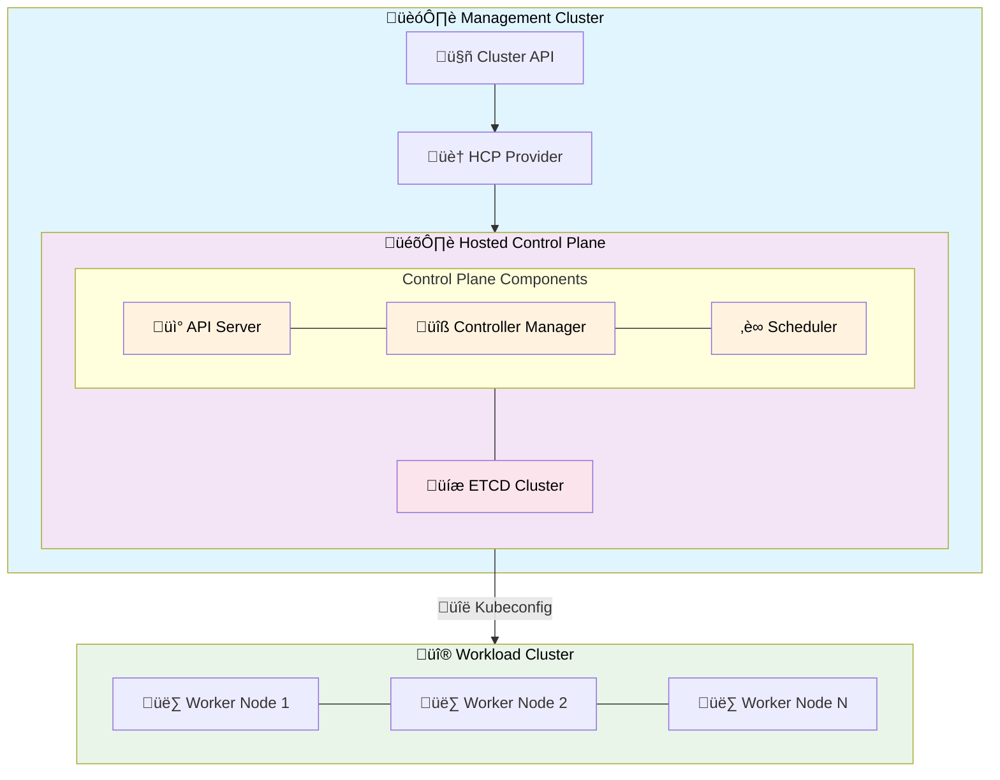

# 🏗️ Cluster API Control Plane Provider for Hosted Control Planes

[](https://goreportcard.com/report/github.com/teutonet/cluster-api-provider-hosted-control-plane)
[](LICENSE)

A Kubernetes Cluster API control plane provider that enables management of hosted control planes as first-class
Kubernetes resources. This provider allows you to create and manage highly available Kubernetes control plane components
(API Server, Controller Manager, Scheduler, and etcd) as hosted services, decoupling them from the underlying
infrastructure.

## 🌟 What is a Hosted Control Plane?

Traditional Kubernetes clusters tightly couple the control plane components with worker nodes on the same
infrastructure.
Hosted control planes break this coupling by running control plane components as managed services, offering:

- **Infrastructure Independence**: Control planes run separately from worker nodes
- **Enhanced Reliability**: Dedicated infrastructure for control plane components
- **Simplified Operations**: Automated lifecycle management and upgrades
- **Cost Optimization**: Shared control plane infrastructure across multiple clusters
- **Faster Provisioning**: Pre-provisioned control planes reduce cluster creation time

## 🚀 Key Features

### 🎯 Core Capabilities

- **Multi-Replica Control Plane**: Horizontal scaling for high availability
- **Automated ETCD Management**: Built-in backup/restore with S3 integration
- **Gateway API Integration**: Modern traffic routing and load balancing
- **Certificate Management**: Automated TLS via cert-manager integration
- **OpenTelemetry Observability**: Comprehensive tracing and monitoring
- **Cloud-Native Storage**: S3-compatible backup solutions

### 🔧 Advanced Features

- **Network Policy Support**: Component-based access control

## 🏛️ Architecture



## 🛠️ Installation

### Prerequisites

- Kubernetes cluster (management cluster) v1.28+
- Cluster API v1.10+ installed
- cert-manager for certificate management
- Gateway API CRDs (for traffic routing)

### Install the Provider

```bash
# Install using the latest release
kubectl apply -f https://github.com/teutonet/cluster-api-provider-hosted-control-plane/releases/latest/download/control-plane-components.yaml

# Or install a specific version
kubectl apply -f https://github.com/teutonet/cluster-api-provider-hosted-control-plane/releases/download/v0.1.0/control-plane-components.yaml
```

### Verify Installation

```bash
kubectl get pods -n cluster-api-provider-hosted-control-plane-system
```

## 📖 Usage

### Basic Hosted Control Plane

```yaml
apiVersion: controlplane.cluster.x-k8s.io/v1alpha1
kind: HostedControlPlane
metadata:
  name: my-hosted-control-plane
  namespace: default
spec:
  version: v1.33.0
  replicas: 3
  gateway:
    name: capi
    namespace: capi-system
```

### Integration with Cluster API

```yaml
apiVersion: cluster.x-k8s.io/v1beta1
kind: Cluster
metadata:
  name: my-cluster
spec:
  controlPlaneRef:
    apiVersion: controlplane.cluster.x-k8s.io/v1alpha1
    kind: HostedControlPlane
    name: my-hosted-control-plane
  infrastructureRef:
    apiVersion: infrastructure.cluster.x-k8s.io/v1beta1
    kind: AWSCluster # Or your infrastructure provider
    name: my-aws-cluster
```

## 🎛️ Configuration

### Environment Variables

| Variable                      | Description                      | Default                               |
|-------------------------------|----------------------------------|---------------------------------------|
| `LEADER_ELECTION`             | Enable leader election           | true                                  |
| `WEBHOOK_CERT_DIR`            | Directory for webhook certs      | /tmp/k8s-webhook-server/serving-certs |
| `MAX_CONCURRENT_RECONCILES`   | Max concurrent reconciles        | 10                                    |
| `CONTROLLER_NAMESPACE`        | Namespace for the controller     |                                       |
| `LOG_FORMAT`                  | Log format (json or text)        | json                                  |
| `LOG_LEVEL`                   | Log level (debug, info, etc.)    | info                                  |
| `OTEL_EXPORTER_OTLP_ENDPOINT` | OpenTelemetry collector endpoint | -                                     |

## 🧪 Development

### Prerequisites

- Go 1.24+
- kubectl
- [Task](https://taskfile.dev) (for building and testing)

### Build and Test

```bash
# Build the project
task build

# Run tests
task test

# Run linting
task lint

# Generate manifests
task manifests

# Full CI pipeline
task ci
```

### Local Development

```bash
# have CAPI installed
task manifests
kubectl apply -f ./build/control-plane-components.yaml
task dev
# Run the controller locally within you IDE (.run for IDEA provided)
```

## 🤝 Contributing

We welcome contributions! Please see our [Contributing Guide](CONTRIBUTING.md)
for details on:

- Code of Conduct
- Development process
- Pull request guidelines
- Issue reporting

### Development Workflow

1. Fork the repository
2. Create a feature branch (`git switch -c feature/amazing-feature`)
3. Make your changes
4. Run tests and linting (`task ci`)
5. Commit your changes (`git commit`)
6. Push to the branch (`git push fork feature/amazing-feature`)
7. Open a Pull Request (`gh pr create` is amazing!)

## 📋 Compatibility

| Component    | Version          |
|--------------|------------------|
| Kubernetes   | v1.28+           |
| Cluster API  | v1.10+           |
| cert-manager | v1.18+           |
| Gateway API  | v1.3+ (optional) |
| Go           | 1.24+            |

## 🛣️ Roadmap

- [ ] **Enhanced Monitoring**: Prometheus metrics
- [ ] **Auto-Scaling**: Dynamic control plane scaling based on load

## 🆘 Support

- **GitHub Issues**: [Report bugs or request features](https://github.com/teutonet/cluster-api-provider-hosted-control-plane/issues)
- **Discussions**: [Community discussions and Q&A](https://github.com/teutonet/cluster-api-provider-hosted-control-plane/discussions)

## 📄 License

This project is licensed under the GNU Affero General Public License v3.0 -
see the [LICENSE](LICENSE) file for details.

---

<div align="center">

**Built with ❤️ by the [teuto.net](https://teuto.net) team**

[⭐ Star us on GitHub](https://github.com/teutonet/cluster-api-provider-hosted-control-plane) • [🐛 Report Issues](https://github.com/teutonet/cluster-api-provider-hosted-control-plane/issues) • [💬 Join Discussions](https://github.com/teutonet/cluster-api-provider-hosted-control-plane/discussions)

</div>
